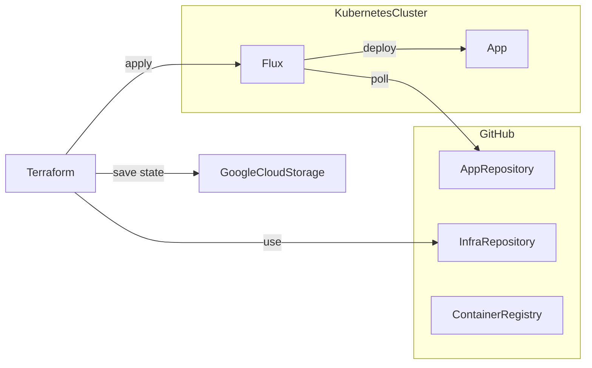

## Setup
```sh
read -s TELE_TOKEN_RAW

export TELE_TOKEN_RAW

TELE_TOKEN=$(echo $TELE_TOKEN_RAW | tr -d '\n' | base64)

kubectl create secret generic kbot-helm-values \
    --namespace=kbot-tf-flux \
	--from-file=values.yaml=./helm-values.yaml

envsubst '$TELE_TOKEN' < helm-values.tpl.yaml > helm-values.yaml

terraform apply -var-file="vars.tfvars"

# gcloud container clusters get-credentials kbot --location=<location>
```

## Resources
- [google | kubernetes-engine/auth](https://registry.terraform.io/modules/terraform-google-modules/kubernetes-engine/google/latest/submodules/auth)
- [Flux | Core Concepts](https://fluxcd.io/flux/concepts/)
- [Terraform | Modules](https://developer.hashicorp.com/terraform/language/modules)
- [flux create source git](https://fluxcd.io/flux/cmd/flux_create_source_git/)
- [flux create helmrelease](https://fluxcd.io/flux/cmd/flux_create_helmrelease/)
- [Kubernetes | Managing Secrets using kubectl](https://kubernetes.io/docs/tasks/configmap-secret/managing-secret-using-kubectl/)
